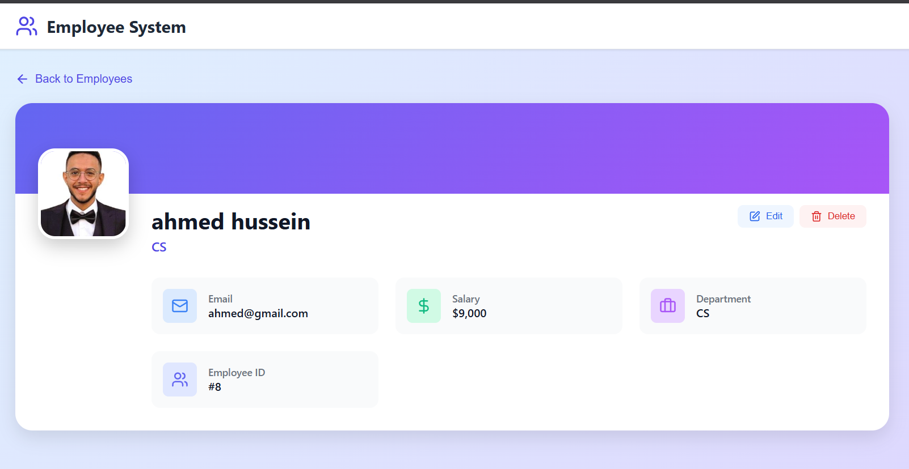
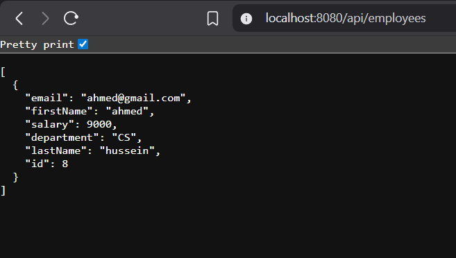
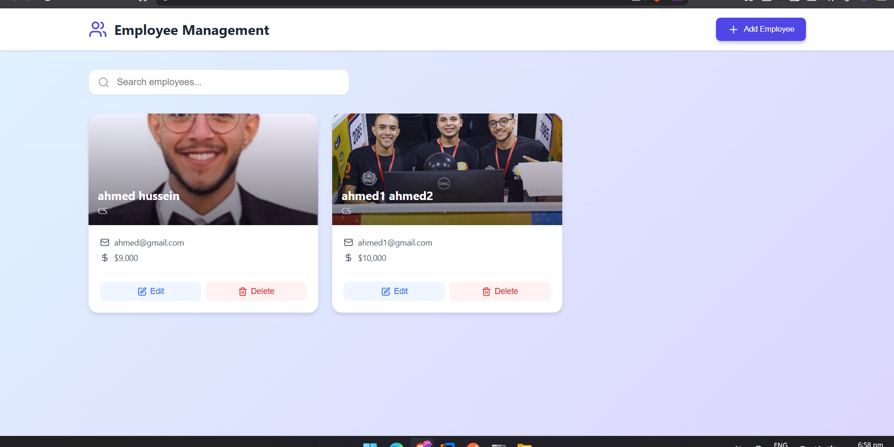

# 🏢 Employee Management System

A full-stack web application for managing employees with CRUD operations, built with Spring Boot and React.


## 👨‍💻 Author

**Ahmed**
- GitHub: [@ahmed2005hussen](https://github.com/ahmed2005hussen)
- LinkedIn: [Ahmed Elsherif](https://www.linkedin.com/in/ahmed-elsherif-119b60337/)

---

## 🎯 About

This project is a comprehensive Employee Management System built to demonstrate CRUD (Create, Read, Update, Delete) operations in a backend-focused architecture.

The backend was fully developed by me using Spring Boot, providing a complete RESTful API for managing employee data.

The frontend was implemented using React, with UI components and layout generated with the assistance of Claude AI

The application allows users to:
- View all employees in a responsive card layout
- Search employees by name or department
- Add new employees with custom profile pictures
- Edit existing employee information
- Delete employee records
- View detailed employee information

---

## ✨ Features

### Core Functionality
- ✅ **Full CRUD Operations** - Create, Read, Update, and Delete employees
- 🔍 **Search & Filter** - Real-time search by name or department
- 📸 **Image Upload** - Custom profile pictures for each employee
- 📱 **Responsive Design** - Works seamlessly on desktop and mobile devices
- 🎨 **Modern UI** - Clean, intuitive interface with smooth animations
- ⚡ **Fast Performance** - Optimized React frontend with efficient API calls

### Technical Features
- 🔄 **RESTful API** - Well-structured REST endpoints
- 🗄️ **JPA/Hibernate** - Database abstraction and ORM
- 🌐 **CORS Configured** - Secure cross-origin resource sharing
- 📦 **Maven Build** - Easy dependency management
- 🎯 **Service Layer Pattern** - Clean architecture with separation of concerns
- 🔧 **Entity Manager** - Direct database operations for complex queries

---

## 🛠️ Technology Stack

### Backend
- **Framework:** Spring Boot 3.x
- **Language:** Java 17
- **Database:** MySQL / H2 (configurable)
- **ORM:** JPA/Hibernate
- **Build Tool:** Maven
- **API:** REST

### Frontend
- **Library:** React 18.x
- **Language:** JavaScript (ES6+)
- **Styling:** Custom CSS
- **Icons:** Lucide React
- **HTTP Client:** Fetch API

---

## 📸 Screenshots

### Main Dashboard
The main page displays all employees in a beautiful card layout with quick actions.


### Employee Cards
Each employee is displayed with their photo, name, department, email, and salary. Quick Edit and Delete buttons are available on each card.




### REST API Endpoints
The application exposes a complete REST API for all CRUD operations.


### API Response
Example JSON response from the GET /api/employees endpoint.



### Add Employee Modal
Beautiful UI showing all employee information with edit and delete options.


### Add Data For Employee
User-friendly modal for adding new employees with image upload support.


### After Add Employee 



### API Responsed 


---

## 📡 API Documentation

### Base URL
```
http://localhost:8080/api
```

### Endpoints

#### Get All Employees
```http
GET /api/employees
```

**Response:**
```json
[
  {
    "id": 1,
    "firstName": "Ahmed",
    "lastName": "Hussein",
    "email": "ahmed@gmail.com",
    "salary": 9000,
    "department": "CS"
  }
]
```

#### Get Employee by ID
```http
GET /api/employees/{id}
```

#### Create New Employee
```http
POST /api/employees
Content-Type: application/json

{
  "firstName": "Ahmed",
  "lastName": "Hussein",
  "email": "ahmed@gmail.com",
  "salary": 9000,
  "department": "CS"
}
```

#### Update Employee
```http
PUT /api/employees
Content-Type: application/json

{
  "id": 1,
  "firstName": "Ahmed",
  "lastName": "Hussein",
  "email": "ahmed@gmail.com",
  "salary": 10000,
  "department": "CS"
}
```

#### Partial Update Employee
```http
PATCH /api/employees/{id}
Content-Type: application/json

{
  "salary": 12000
}
```

#### Delete Employee
```http
DELETE /api/employees/{id}
```

---

## 📁 Project Structure

```
employee-management-system/
├── backend/                    # Spring Boot Backend
│   ├── src/
│   │   ├── main/
│   │   │   ├── java/
│   │   │   │   └── com/ahmed/demo/
│   │   │   │       ├── config/
│   │   │   │       │   └── CorsConfig.java
│   │   │   │       ├── DAO/
│   │   │   │       │   ├── EmployeeDAO.java
│   │   │   │       │   └── EmployeeDAOImplementation.java
│   │   │   │       ├── entity/
│   │   │   │       │   └── Employee.java
│   │   │   │       ├── Rest/
│   │   │   │       │   └── EmployeeRest.java
│   │   │   │       ├── Service/
│   │   │   │       │   ├── EmployeeService.java
│   │   │   │       │   └── EmployeeServiceImplementation.java
│   │   │   │       └── EmployeeSystemApplication.java
│   │   │   └── resources/
│   │   │       └── application.properties
│   │   └── test/
│   └── pom.xml
│
├── frontend/                   # React Frontend
│   ├── public/
│   ├── src/
│   │   ├── App.js
│   │   ├── EmployeeApp.css
│   │   ├── index.js
│   │   └── index.css
│   ├── package.json
│   └── package-lock.json
│
└── README.md
```

---

## 🏗️ Architecture

### Backend Architecture

The backend follows a **layered architecture** pattern:

1. **REST Layer** (`EmployeeRest.java`)
   - Handles HTTP requests and responses
   - Maps endpoints to service methods
   - Validates input data

2. **Service Layer** (`EmployeeService.java`)
   - Contains business logic
   - Manages transactions
   - Coordinates between REST and DAO layers

3. **DAO Layer** (`EmployeeDAO.java`)
   - Direct database operations
   - Uses EntityManager for JPA queries
   - Handles data persistence

4. **Entity Layer** (`Employee.java`)
   - JPA entity representing database table
   - Maps Java objects to database records

5. **Configuration** (`CorsConfig.java`)
   - CORS configuration for frontend communication
   - Security settings

### Frontend Architecture

The frontend is built with **React hooks** and follows component-based architecture using **Claude ai**:

- **State Management:** React useState hooks
- **Side Effects:** useEffect for API calls
- **Styling:** Custom CSS with modern design patterns
- **Routing:** Single-page application with conditional rendering

---

## 🔧 Configuration

### CORS Configuration

The backend is configured to accept requests from the frontend. Update `CorsConfig.java` if deploying to different domains:

```java
.allowedOrigins(
    "http://localhost:3000",
    "https://your-frontend-domain.com"
)
```
---


